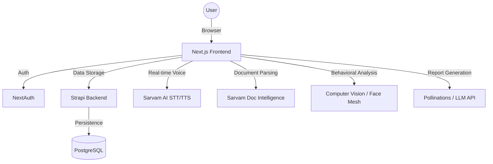

# 🎙️ NeuraView: The Future of AI-Powered Career Coaching

**NeuraView** is an intelligent, high-fidelity mock interview and career preparation platform designed to bridge the gap between preparation and placement. By leveraging advanced LLMs, real-time multimodal analysis, and interactive UI components, NeuraView provides a realistic, high-pressure, yet encouraging environment for candidates to hone their skills.

--- 

## 🚀 Vision
Empowering students to "mirror" their excellence through AI-driven insights, behavioral coaching, and personalized learning roadmaps.

---

## ✨ Key Features

### 1. 🤖 AI-Driven Mock Interviews (powered by Sarvam AI)
- **Role-Based Context**: Interviews that adapt to your specific job role (Frontend, Backend, HR, etc.), seniority, and technical stack.
- **Ultra-Low Latency Conversation**: Optimized STT/TTS pipeline using **Sarvam AI** for near-instant, "human-like" conversation (<1.2s lag).
- **Natural Interaction**: No "push-to-talk" needed. The AI detects natural thinking pauses and responds automatically.
- **Multilingual Support**: Conduct interviews in various Indian languages (English, Hindi, etc.) with regional accent support.

### 2. 👁️ Real-time Behavioral & Facial Analytics
- **Confidence Scoring**: Advanced computer vision (Face Mesh) analyzes facial cues, eye contact, and emotional state.
- **Nervousness Detection**: Identifies signs of hesitation or nervousness to help you project a more composed persona.
- **Engagement Analysis**: Tracks how well you maintain focus and engagement throughout the session.

### 3. 📄 AI Resume Scanner & Skill Extractor
- **Deep Document Intelligence**: Upload your PDF resume for instant parsing via Sarvam AI.
- **Skill Insight**: Automatically extract technical skills, professional summaries, and identifiable improvements.
- **Auto-Setup**: Generates suggested interview parameters (difficulty, role, duration) based on your resume content.

### 4. 📚 Smart Summarizer & Quiz Generator
- **Learning Accelerator**: Upload research papers, documentation, or study materials.
- **Instant Summarization**: Get concise, bulleted summaries of complex documents.
- **Interactive Quizzes**: Test your knowledge immediately with AI-generated quizzes based on the uploaded content.

### 5. 📊 Comprehensive Performance Reports
- **Holistic Evaluation**: Detailed scores across Technical Knowledge, Communication, Problem Solving, and Composure.
- **Actionable Feedback**: Concrete "Next Steps" and "Improvements" tailored to your performance.
- **Conversation Replay**: Review your entire transcript with AI-annotated insights.

### 6. 🗺️ Dynamic Career Roadmaps
- **AI Career Assistant**: A dedicated chat-based assistant (/roadmap-chat) to guide your career path.
- **Visualized Milestones**: Interactive roadmaps that help you track your progress towards landing your dream job.

---

## 🛠 Tech Stack

### Frontend
- **Framework**: [Next.js 14+](https://nextjs.org/) (App Router)
- **Styling**: [Tailwind CSS](https://tailwindcss.com/) + [Framer Motion](https://www.framer.com/motion/)
- **UI Components**: Radix UI (Shadcn/UI) + Custom Glassmorphic Components
- **Animations**: Aceternity UI inspired cinematic effects
- **State Management**: React Context API & Custom Hooks

### Backend
- **CMS**: [Strapi 5](https://strapi.io/) (Headless CMS for content and user management)
- **Database**: PostgreSQL / SQLite (via Better-SQLite3)
- **Auth**: [NextAuth.js](https://next-auth.js.org/)

### AI & Intelligence
- **Voice/Document AI**: [Sarvam AI](https://www.sarvam.ai/) (TTS, STT, Document Intelligence)
- **LLM Engine**: Pollinations AI (Mistral-7B / GPT-4o integration)
- **Computer Vision**: TensorFlow.js / MediaPipe (Face Mesh for behavioral analytics)

---

## 🔄 Project Workflow

### 1. Preparation Phase (Scanning & Summarizing)
Users can start by uploading their **Resume** to get a skill gap analysis or **Study Documents** to summarize complex topics. This phase helps the user prepare the knowledge base needed for the interview.

### 2. Interview Setup Phase
The user configures their interview:
- Job Topic (e.g., "Fullstack React Developer")
- Difficulty Level (Easy, Medium, Hard)
- Duration (Calculated in minutes)
- Interview Mode (Technical or HR)

### 3. Live Interview Phase
The user interacts with the AI Interviewer:
- **Audio Output**: AI speaks using high-fidelity streaming TTS.
- **Audio Input**: User responds via voice (STT) or text.
- **Visual Feedback**: The system performs sub-second facial analysis while the user speaks.

### 4. Analysis & Growth Phase
Upon completion, the raw conversation and behavioral data are sent to the **Report API**. A structured JSON report is generated, saved to the database, and presented to the user for review and improvement.

---

## 📖 User Guide

### 🚦 Prerequisites
- Node.js 18+ 
- NPM / PNPM / Bun
- Sarvam AI API Key
- Strapi Admin Access

### 🔧 Installation

#### 1. Clone the Repository
```bash
git clone https://github.com/TeamLimitless/NeuraView.git
cd NeuraView
```

#### 2. Setup Backend (Strapi)
```bash
cd backend
npm install
# Configure your .env file (see .env.example)
npm run develop
```

#### 3. Setup Frontend (Next.js)
```bash
cd ../frontend
npm install
# Configure your .env file (see .env.local)
npm run dev
```

### 💡 How to Use
1. **Login**: Navigate to the dashboard and sign in.
2. **Scan Resume**: (Optional) Use the Resume Scanner to pre-fill your interview profile.
3. **Start Interview**: Go to "Create Interview", enter your details, and hit start.
4. **Interact**: Talk to the AI naturally. Ensure your camera is on for facial analysis.
5. **View Report**: Once finished, wait for the AI to analyze your data and view your comprehensive report in the "Reports" section.
6. **Study**: Use the "AI Summarizer" to learn from feedback or new documents.

---

## 🏗 System Architecture



---

## 🤝 Contributing
Neuraview is part of the **Aurobindo AI Hackathon**. We welcome contributions that enhance the AI's empathy, accuracy, and technical depth.

 
---

Created with ❤️ by **Team Limitless** (LimitlessAI04).
